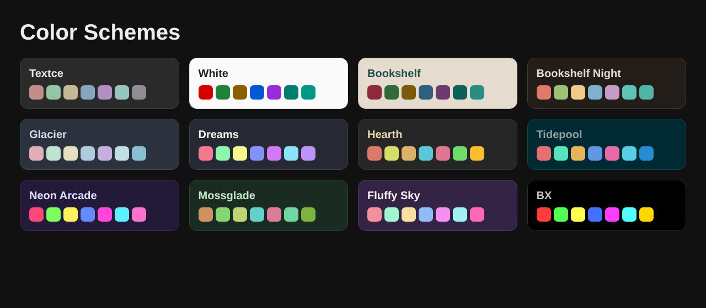

# Color Schemes

### *Twelve palettes. Each one, a place to be.*

  

---

## Color is the first thing you feel.

Before you read a word, before you notice a single line of type, color has already told you where you are. Whether the room is calm or electric. Whether it is made for the morning or for the small hours.

We believe the place you work should be worth being in. So we built twelve of them.

Each scheme begins with a mood, then a material. Graphite. Paper. Ice. Embers. Ocean. Neon. Moss. Every hue is chosen by hand, tuned by eye and checked against the numbers, so the result is not just beautiful but legible, hour after hour. No two schemes share a palette. Each has its own reds, its own greens, its own character.

## The collection

| Scheme | Character | Mode |
|---|---|---|
| [**Textce**](textce-theme) | Flat graphite. Quiet type. The look that needs no introduction. | Dark |
| [**White**](white-theme) | Bright, precise and unmistakably clean. Contrast you can feel. | Light |
| [**Bookshelf**](bookshelf-theme) | Tan, cream and teal ink. The color of a quiet afternoon with a good book. | Light |
| [**Bookshelf Night**](bookshelf-night-theme) | Roasted brown, cream ink and a teal that glows instead of shouts. | Dark |
| [**Glacier**](glacier-theme) | Slate, frost and a single pale blue. Stillness you can work in. | Dark |
| [**Dreams**](dreams-theme) | Deep indigo, soft lavender and pink with a pulse. Colour with personality. | Dark |
| [**Hearth**](hearth-theme) | Warm charcoal, cream type and the amber glow of embers. | Dark |
| [**Tidepool**](tidepool-theme) | Dark teal, sea glass and a clear blue. Precise, restful, deliberate. | Dark |
| [**Neon Arcade**](neon-arcade-theme) | Violet night, hot pink and electric cyan. Bold on purpose. | Dark |
| [**Mossglade**](mossglade-theme) | Forest depth, soft sage and lichen gold. Natural, not novelty. | Dark |
| [**Fluffy Sky**](fluffy-sky-theme) | Plum, blush and bubblegum. Dark, but cheerful. | Dark |
| [**BX**](bx-theme) | True black, vivid primaries and a gold cursor. The console at its most honest. | Dark |

## Everywhere you work

Every scheme ships complete, with the same twelve ports:

**Editors:** VS Code, Sublime Text, Neovim and Vim
**Terminals:** Windows Terminal, iTerm2, Alacritty, kitty, WezTerm, Ghostty, X11
**Web:** CSS custom properties and Sass variables
**Apps:** a `.textcetheme` file for [Textce](https://textce.com), where these schemes first appeared

Each folder contains a README with a full palette, install steps for every tool and an accessibility report. [`palette.json`](palette.json) in the root combines all twelve.

## Made to be read

Beauty that you cannot read is decoration. Every foreground color is measured against its background with the WCAG contrast formula. Terminal and syntax colors meet 4.5 : 1 or better, and each theme's README publishes the numbers.

## Contributing

Ports for other tools are very welcome: JetBrains, Zed, tmux, Obsidian, bat, delta and more. Take colors from `palette.json` so every port stays identical, and keep normal text at 4.5 : 1 or better.

## License

[MIT](LICENSE). Use it, change it, ship it. Glacier, Dreams, Hearth and Tidepool derive from MIT projects; see [`NOTICE.md`](NOTICE.md).

Designed and made with care by Richard Ward (zeamp).

