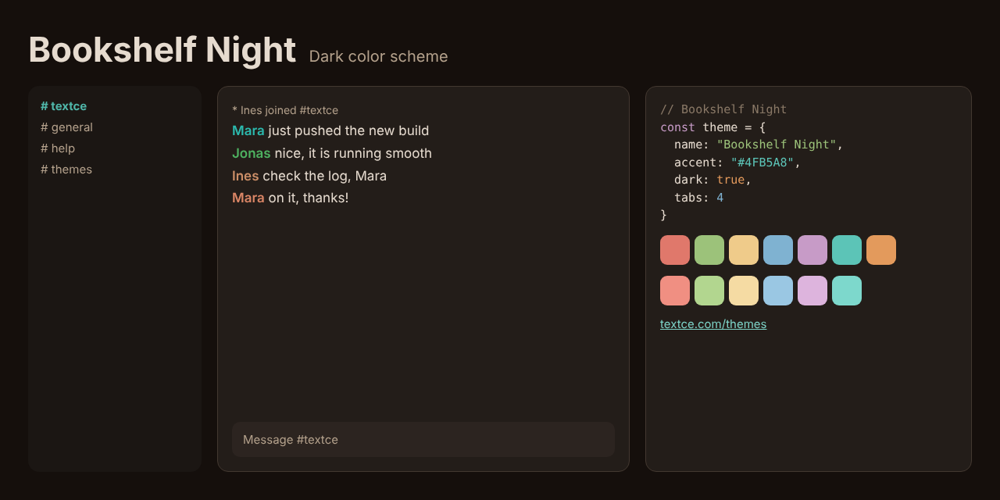

<div align="center">



<br>

# Bookshelf Night

### *The same room, after the lamps come on.*

[](LICENSE)  

[Overview](#overview) · [Design](#design) · [Palette](#palette) · [Install](#install) · [Accessibility](#accessibility) · [License](#license)

</div>

---

## Overview

Evening arrives. Someone lights the lamps.

**Bookshelf Night** keeps everything that made Bookshelf feel inviting and exchanges daylight for lamplight. The paper deepens to roasted brown. The ink turns cream. The teal accent brightens just enough to glow, never enough to glare.

It is a dark theme that feels like a place, not a void.

## Design

| | |
|---|---|
| **Lamplight, not darkness** | Backgrounds stay warm and brown instead of cold blue-black, which is gentler on the eyes at night. |
| **Cream, not white** | Text is a soft cream that holds contrast without the harshness of pure white. |
| **A companion, by design** | Every role maps one to one with Bookshelf, so you can move between day and night without relearning anything. |

## Palette

| Role | Swatch | Hex | Where |
|---|---|---|---|
| Background |  | `#231D19` | Conversation area |
| Sidebar and panels |  | `#1B1613` | Channel list, user list, window chrome |
| Inputs |  | `#2C2420` | Message box and widgets |
| Dividers |  | `#433830` | Lines and borders |
| Text |  | `#E6DBCF` | Messages |
| Event lines |  | `#B3A08B` | Joins, parts, timestamps |
| Links |  | `#7DD3C7` | URLs and emphasis |
| Accent |  | `#4FB5A8` | Selection, buttons, highlights |
| Highlight |  | `#EFCB8A` | Mentions |

Nickname colors: `#2CBAAE` `#4EB160` `#CB8E67` `#DB8666` `#DA8694` `#C18AC1`

<details>
<summary><strong>Terminal and syntax colors</strong></summary>

<br>

| | Normal | Bright |
|---|---|---|
| Black |  `#433830` |  `#6B5A4C` |
| Red |  `#E0786B` |  `#F08F82` |
| Green |  `#9CC27A` |  `#B2D68F` |
| Yellow |  `#EFCB8A` |  `#F5DBA3` |
| Blue |  `#7FB2D1` |  `#9AC7E3` |
| Magenta |  `#C79BC7` |  `#DDB4DD` |
| Cyan |  `#5CC4B7` |  `#7DD8CC` |
| White |  `#DCCEC3` |  `#F3EBE1` |
| Orange |  `#E39A5C` | |

</details>

<details>
<summary><strong>Editor colors</strong></summary>

<br>

| Role | Hex |
|---|---|
| Selection | `#4A3F2E` |
| Cursor | `#EFCB8A` |
| Line highlight / panels | `#1B1613` |
| Deep panels | `#150F0C` |
| Comments | `#8A7967` |
| Muted text | `#B3A08B` |
| Error | `#F0645A` |
| Warning | `#EFB04A` |
| Success | `#6FCB8F` |

</details>

[`palette.json`](palette.json) holds every value in this theme and is the source for all the ports.

## Install

| Tool | Files |
|---|---|
| [Textce](#textce) | [`textce/`](textce) |
| [VS Code](#vs-code) | [`vscode/`](vscode) |
| [Sublime Text](#sublime-text) | [`sublime/`](sublime) |
| [Neovim and Vim](#neovim-and-vim) | [`vim/colors/`](vim/colors) |
| [Windows Terminal](#windows-terminal) | [`terminals/windows-terminal/`](terminals/windows-terminal) |
| [iTerm2](#iterm2) | [`terminals/iterm2/`](terminals/iterm2) |
| [Alacritty](#alacritty) | [`terminals/alacritty/`](terminals/alacritty) |
| [kitty](#kitty) | [`terminals/kitty/`](terminals/kitty) |
| [WezTerm](#wezterm) | [`terminals/wezterm/`](terminals/wezterm) |
| [Ghostty](#ghostty) | [`terminals/ghostty/`](terminals/ghostty) |
| [X11, urxvt, xterm](#x11) | [`terminals/xresources/`](terminals/xresources) |
| [Websites](#css-and-sass) | [`css/`](css) |

### Textce

Open **Settings › Appearance › Theme Developer**, click **Import…** and choose [`textce/bookshelf-night-theme.textcetheme`](textce/bookshelf-night-theme.textcetheme). The theme appears in your theme list immediately.

### VS Code

```sh
# macOS and Linux
cp -r vscode ~/.vscode/extensions/bookshelf-night-theme
```

```powershell
# Windows
Copy-Item -Recurse vscode "$env:USERPROFILE\.vscode\extensions\bookshelf-night-theme"
```

Restart VS Code, open **Preferences: Color Theme** and pick **Bookshelf Night**.

### Sublime Text

Copy [`bookshelf-night-theme.sublime-color-scheme`](sublime/bookshelf-night-theme.sublime-color-scheme) into your `Packages/User` folder. Open it from **Preferences › Browse Packages…**. Then choose **Preferences › Select Color Scheme…** and pick **Bookshelf Night**. Or set it directly:

```json
{ "color_scheme": "Packages/User/bookshelf-night-theme.sublime-color-scheme" }
```

### Neovim and Vim

```sh
mkdir -p ~/.config/nvim/colors && cp vim/colors/bookshelf-night-theme.vim ~/.config/nvim/colors/   # Neovim
mkdir -p ~/.vim/colors && cp vim/colors/bookshelf-night-theme.vim ~/.vim/colors/                   # Vim
```

```vim
set termguicolors
colorscheme bookshelf-night-theme
```

### Windows Terminal

Paste the entry from [`bookshelf-night-theme.json`](terminals/windows-terminal/bookshelf-night-theme.json) into the `schemes` array of `settings.json`, then:

```json
{ "profiles": { "defaults": { "colorScheme": "Bookshelf Night" } } }
```

### iTerm2

**Settings › Profiles › Colors › Color Presets… › Import…**, then choose [`bookshelf-night-theme.itermcolors`](terminals/iterm2/bookshelf-night-theme.itermcolors).

### Alacritty

```toml
# ~/.config/alacritty/alacritty.toml
[general]
import = ["~/.config/alacritty/bookshelf-night-theme.toml"]
```

### kitty

```conf
# ~/.config/kitty/kitty.conf
include bookshelf-night-theme.conf
```

### WezTerm

Copy [`bookshelf-night-theme.toml`](terminals/wezterm/bookshelf-night-theme.toml) to `~/.config/wezterm/colors/`, then:

```lua
config.color_scheme = "Bookshelf Night"
```

### Ghostty

Copy [`bookshelf-night-theme`](terminals/ghostty/bookshelf-night-theme) to `~/.config/ghostty/themes/`, then:

```
theme = bookshelf-night-theme
```

### X11

```sh
xrdb -merge terminals/xresources/bookshelf-night-theme.Xresources
```

### CSS and Sass

```html
<link rel="stylesheet" href="bookshelf-night-theme.css">
```

```css
body { background: var(--tc-bg); color: var(--tc-fg); }
a { color: var(--tc-accent-deep); }
```

A Sass variable file, [`bookshelf-night-theme.scss`](css/bookshelf-night-theme.scss), is included.

## Accessibility

| Pair | Contrast | Result |
|---|---|---|
| Text on background | 12.2 : 1 | AAA |
| Muted text on background | 6.6 : 1 | AA |
| Links on background | 9.5 : 1 | AAA |
| Accent on background | 6.7 : 1 | AA |
| Event lines on background | 6.6 : 1 | AA |
| Comments on background | 4.0 : 1 | AA large |
| Syntax and terminal colors (lowest) | 5.6 : 1 | AA |

> [!NOTE]
> Contrast is measured against the theme background with the WCAG formula. "AA large" means the pair is suitable for large text and interface elements, not body text.

## Contributing

Ports for other tools are welcome: JetBrains, Zed, tmux, Obsidian, bat, delta and more. Please take colors from [`palette.json`](palette.json) so every port stays identical, and keep normal text at 4.5 : 1 or better.

## The collection

| Theme | Character | Mode |
|---|---|---|
| [Textce](../textce-theme) | Flat graphite. Quiet type. The look that needs no introduction. | Dark |
| [White](../white-theme) | Bright, precise and unmistakably clean. Contrast you can feel. | Light |
| [Bookshelf](../bookshelf-theme) | Tan, cream and teal ink. The color of a quiet afternoon with a good book. | Light |
| [Bookshelf Night](../bookshelf-night-theme) | Roasted brown, cream ink and a teal that glows instead of shouts. | Dark |
| [Glacier](../glacier-theme) | Slate, frost and a single pale blue. Stillness you can work in. | Dark |
| [Dreams](../dreams-theme) | Deep indigo, soft lavender and pink with a pulse. Colour with personality. | Dark |
| [Hearth](../hearth-theme) | Warm charcoal, cream type and the amber glow of embers. | Dark |
| [Tidepool](../tidepool-theme) | Dark teal, sea glass and a clear blue. Precise, restful, deliberate. | Dark |
| [Neon Arcade](../neon-arcade-theme) | Violet night, hot pink and electric cyan. Bold on purpose. | Dark |
| [Mossglade](../mossglade-theme) | Forest depth, soft sage and lichen gold. Natural, not novelty. | Dark |
| [Fluffy Sky](../fluffy-sky-theme) | Plum, blush and bubblegum. Dark, but cheerful. | Dark |
| [BX](../bx-theme) | True black, vivid primaries and a gold cursor. The console at its most honest. | Dark |

## License

Released under the [MIT License](LICENSE). Use it, change it, ship it. The Textce name and logo are not covered by this license.

<div align="center">
<sub>Designed and made with care by Richard Ward (zeamp).<br>First introduced in <a href="https://textce.com">Textce</a>.</sub>
</div>
