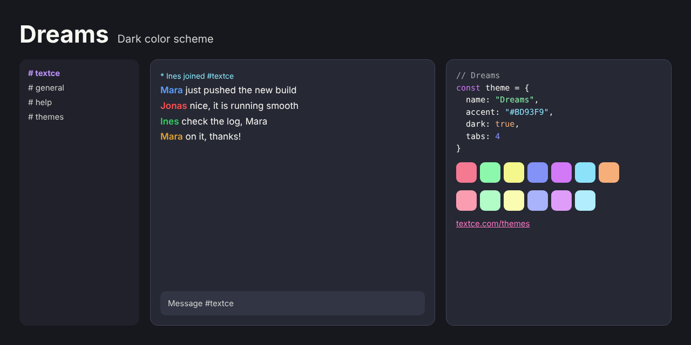

<div align="center">



<br>

# Dreams

### *Twilight, with the lights just coming on.*

[](LICENSE)  

[Overview](#overview) · [Design](#design) · [Palette](#palette) · [Install](#install) · [Accessibility](#accessibility) · [License](#license)

</div>

---

## Overview

It is dusk. The sky is deep indigo, and the first neon signs are flickering on.

**Dreams** is a theme with a pulse. A rich indigo base. Lavender accents. Pink links. Mint, lemon and sky blue for everything in between, each one saturated enough to sing and balanced enough to read for hours.

It is playful without being loud. Expressive without being tiring.

## Design

| | |
|---|---|
| **Indigo depth** | The background is a deep, saturated indigo rather than black, which makes every color above it glow. |
| **Bright, balanced color** | Each syntax color carries the same visual weight, so no single hue overpowers the rest. |
| **Pink with purpose** | Links and emphasis are a warm pink that stands apart from the cool base. |

## Palette

| Role | Swatch | Hex | Where |
|---|---|---|---|
| Background |  | `#262834` | Conversation area |
| Sidebar and panels |  | `#20212A` | Channel list, user list, window chrome |
| Inputs |  | `#323543` | Message box and widgets |
| Dividers |  | `#414456` | Lines and borders |
| Text |  | `#F8F8F2` | Messages |
| Event lines |  | `#8BE9FD` | Joins, parts, timestamps |
| Links |  | `#FF79C6` | URLs and emphasis |
| Accent |  | `#BD93F9` | Selection, buttons, highlights |
| Highlight |  | `#FFCE1B` | Mentions |

Nickname colors: `#5CA0FF` `#FF5050` `#30D060` `#E0A030` `#C070F0` `#00917F`

<details>
<summary><strong>Terminal and syntax colors</strong></summary>

<br>

| | Normal | Bright |
|---|---|---|
| Black |  `#414456` |  `#7E7F84` |
| Red |  `#F67992` |  `#FA9DB0` |
| Green |  `#8CF8AC` |  `#B1FCC7` |
| Yellow |  `#F4F88C` |  `#F9FCB1` |
| Blue |  `#8392F7` |  `#A8B3FB` |
| Magenta |  `#D179F6` |  `#DF9DFA` |
| Cyan |  `#8CE2F8` |  `#B1EDFC` |
| White |  `#DFDFDA` |  `#FBFBF8` |
| Orange |  `#F6AF79` | |

</details>

<details>
<summary><strong>Editor colors</strong></summary>

<br>

| Role | Hex |
|---|---|
| Selection | `#564A73` |
| Cursor | `#BD93F9` |
| Line highlight / panels | `#20212A` |
| Deep panels | `#17181E` |
| Comments | `#A8A9AA` |
| Muted text | `#D2D3D0` |
| Error | `#FA9DB0` |
| Warning | `#F6AF79` |
| Success | `#8CF8AC` |

</details>

[`palette.json`](palette.json) holds every value in this theme and is the source for all the ports.

## Install

| Tool | Files |
|---|---|
| [Textce](#textce) | [`textce/`](textce) |
| [VS Code](#vs-code) | [`vscode/`](vscode) |
| [Sublime Text](#sublime-text) | [`sublime/`](sublime) |
| [Neovim and Vim](#neovim-and-vim) | [`vim/colors/`](vim/colors) |
| [Windows Terminal](#windows-terminal) | [`terminals/windows-terminal/`](terminals/windows-terminal) |
| [iTerm2](#iterm2) | [`terminals/iterm2/`](terminals/iterm2) |
| [Alacritty](#alacritty) | [`terminals/alacritty/`](terminals/alacritty) |
| [kitty](#kitty) | [`terminals/kitty/`](terminals/kitty) |
| [WezTerm](#wezterm) | [`terminals/wezterm/`](terminals/wezterm) |
| [Ghostty](#ghostty) | [`terminals/ghostty/`](terminals/ghostty) |
| [X11, urxvt, xterm](#x11) | [`terminals/xresources/`](terminals/xresources) |
| [Websites](#css-and-sass) | [`css/`](css) |

### Textce

Open **Settings › Appearance › Theme Developer**, click **Import…** and choose [`textce/dreams-theme.textcetheme`](textce/dreams-theme.textcetheme). The theme appears in your theme list immediately.

### VS Code

```sh
# macOS and Linux
cp -r vscode ~/.vscode/extensions/dreams-theme
```

```powershell
# Windows
Copy-Item -Recurse vscode "$env:USERPROFILE\.vscode\extensions\dreams-theme"
```

Restart VS Code, open **Preferences: Color Theme** and pick **Dreams**.

### Sublime Text

Copy [`dreams-theme.sublime-color-scheme`](sublime/dreams-theme.sublime-color-scheme) into your `Packages/User` folder. Open it from **Preferences › Browse Packages…**. Then choose **Preferences › Select Color Scheme…** and pick **Dreams**. Or set it directly:

```json
{ "color_scheme": "Packages/User/dreams-theme.sublime-color-scheme" }
```

### Neovim and Vim

```sh
mkdir -p ~/.config/nvim/colors && cp vim/colors/dreams-theme.vim ~/.config/nvim/colors/   # Neovim
mkdir -p ~/.vim/colors && cp vim/colors/dreams-theme.vim ~/.vim/colors/                   # Vim
```

```vim
set termguicolors
colorscheme dreams-theme
```

### Windows Terminal

Paste the entry from [`dreams-theme.json`](terminals/windows-terminal/dreams-theme.json) into the `schemes` array of `settings.json`, then:

```json
{ "profiles": { "defaults": { "colorScheme": "Dreams" } } }
```

### iTerm2

**Settings › Profiles › Colors › Color Presets… › Import…**, then choose [`dreams-theme.itermcolors`](terminals/iterm2/dreams-theme.itermcolors).

### Alacritty

```toml
# ~/.config/alacritty/alacritty.toml
[general]
import = ["~/.config/alacritty/dreams-theme.toml"]
```

### kitty

```conf
# ~/.config/kitty/kitty.conf
include dreams-theme.conf
```

### WezTerm

Copy [`dreams-theme.toml`](terminals/wezterm/dreams-theme.toml) to `~/.config/wezterm/colors/`, then:

```lua
config.color_scheme = "Dreams"
```

### Ghostty

Copy [`dreams-theme`](terminals/ghostty/dreams-theme) to `~/.config/ghostty/themes/`, then:

```
theme = dreams-theme
```

### X11

```sh
xrdb -merge terminals/xresources/dreams-theme.Xresources
```

### CSS and Sass

```html
<link rel="stylesheet" href="dreams-theme.css">
```

```css
body { background: var(--tc-bg); color: var(--tc-fg); }
a { color: var(--tc-accent-deep); }
```

A Sass variable file, [`dreams-theme.scss`](css/dreams-theme.scss), is included.

## Accessibility

| Pair | Contrast | Result |
|---|---|---|
| Text on background | 13.7 : 1 | AAA |
| Muted text on background | 9.7 : 1 | AAA |
| Links on background | 6.1 : 1 | AA |
| Accent on background | 6.1 : 1 | AA |
| Event lines on background | 10.6 : 1 | AAA |
| Comments on background | 6.2 : 1 | AA |
| Syntax and terminal colors (lowest) | 5.2 : 1 | AA |

> [!NOTE]
> Contrast is measured against the theme background with the WCAG formula. "AA large" means the pair is suitable for large text and interface elements, not body text.

## Credits

The palette of **Dreams** is derived from [Dracula Theme](https://github.com/dracula/dracula-theme) by Dracula Theme, which is released under the MIT license. See [`NOTICE.md`](NOTICE.md) for the upstream license notice.

Dreams is an independent Textce theme. It is not affiliated with or endorsed by the Dracula Theme project.

## Contributing

Ports for other tools are welcome: JetBrains, Zed, tmux, Obsidian, bat, delta and more. Please take colors from [`palette.json`](palette.json) so every port stays identical, and keep normal text at 4.5 : 1 or better.

## The collection

| Theme | Character | Mode |
|---|---|---|
| [Textce](../textce-theme) | Flat graphite. Quiet type. The look that needs no introduction. | Dark |
| [White](../white-theme) | Bright, precise and unmistakably clean. Contrast you can feel. | Light |
| [Bookshelf](../bookshelf-theme) | Tan, cream and teal ink. The color of a quiet afternoon with a good book. | Light |
| [Bookshelf Night](../bookshelf-night-theme) | Roasted brown, cream ink and a teal that glows instead of shouts. | Dark |
| [Glacier](../glacier-theme) | Slate, frost and a single pale blue. Stillness you can work in. | Dark |
| [Dreams](../dreams-theme) | Deep indigo, soft lavender and pink with a pulse. Colour with personality. | Dark |
| [Hearth](../hearth-theme) | Warm charcoal, cream type and the amber glow of embers. | Dark |
| [Tidepool](../tidepool-theme) | Dark teal, sea glass and a clear blue. Precise, restful, deliberate. | Dark |
| [Neon Arcade](../neon-arcade-theme) | Violet night, hot pink and electric cyan. Bold on purpose. | Dark |
| [Mossglade](../mossglade-theme) | Forest depth, soft sage and lichen gold. Natural, not novelty. | Dark |
| [Fluffy Sky](../fluffy-sky-theme) | Plum, blush and bubblegum. Dark, but cheerful. | Dark |
| [BX](../bx-theme) | True black, vivid primaries and a gold cursor. The console at its most honest. | Dark |

## License

Released under the [MIT License](LICENSE). Use it, change it, ship it. The Textce name and logo are not covered by this license.

<div align="center">
<sub>Designed and made with care by Richard Ward (zeamp).<br>First introduced in <a href="https://textce.com">Textce</a>.</sub>
</div>
