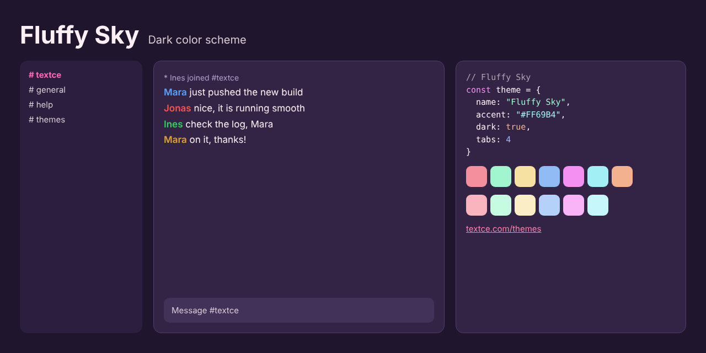

<div align="center">



<br>

# Fluffy Sky

### *Pink clouds over a plum sky.*

[](LICENSE)  

[Overview](#overview) · [Design](#design) · [Palette](#palette) · [Install](#install) · [Accessibility](#accessibility) · [License](#license)

</div>

---

## Overview

Sunset, and the clouds have turned pink.

**Fluffy Sky** is soft, sweet and surprisingly sophisticated. A deep plum background. Blush-white text. Bubblegum, mint, butter and sky blue as the supporting cast. It is cheerful rather than childish, and every pastel is balanced to keep full contrast.

Proof that a dark theme can be happy.

## Design

| | |
|---|---|
| **Plum, not black** | A warm purple base keeps the palette soft and gives pastel colors something to rest on. |
| **Pastels that read** | Each pastel is lightened and saturated precisely enough to stay bright without losing contrast. |
| **Joy as a feature** | The palette is designed to make a long day a little brighter. |

## Palette

| Role | Swatch | Hex | Where |
|---|---|---|---|
| Background |  | `#332445` | Conversation area |
| Sidebar and panels |  | `#2B1E3E` | Channel list, user list, window chrome |
| Inputs |  | `#423159` | Message box and widgets |
| Dividers |  | `#513C6E` | Lines and borders |
| Text |  | `#FFF0F5` | Messages |
| Event lines |  | `#B0A0D0` | Joins, parts, timestamps |
| Links |  | `#FF80AB` | URLs and emphasis |
| Accent |  | `#FF69B4` | Selection, buttons, highlights |
| Highlight |  | `#FFCE1B` | Mentions |

Nickname colors: `#5CA0FF` `#FF5050` `#30D060` `#E0A030` `#C070F0` `#00917F`

<details>
<summary><strong>Terminal and syntax colors</strong></summary>

<br>

| | Normal | Bright |
|---|---|---|
| Black |  `#513C6E` |  `#897A8F` |
| Red |  `#F4909D` |  `#F9B4BD` |
| Green |  `#A2F6CF` |  `#C6FBE2` |
| Yellow |  `#F6E0A2` |  `#FBEDC6` |
| Blue |  `#90BBF4` |  `#B4D2F9` |
| Magenta |  `#F490F1` |  `#F9B4F7` |
| Cyan |  `#A2F0F6` |  `#C6F7FB` |
| White |  `#E6D8DC` |  `#FFF7FA` |
| Orange |  `#F4B190` | |

</details>

<details>
<summary><strong>Editor colors</strong></summary>

<br>

| Role | Hex |
|---|---|
| Selection | `#743A69` |
| Cursor | `#FF69B4` |
| Line highlight / panels | `#2B1E3E` |
| Deep panels | `#1F162D` |
| Comments | `#B1A2B2` |
| Muted text | `#DACBD5` |
| Error | `#F9B4BD` |
| Warning | `#F4B190` |
| Success | `#A2F6CF` |

</details>

[`palette.json`](palette.json) holds every value in this theme and is the source for all the ports.

## Install

| Tool | Files |
|---|---|
| [Textce](#textce) | [`textce/`](textce) |
| [VS Code](#vs-code) | [`vscode/`](vscode) |
| [Sublime Text](#sublime-text) | [`sublime/`](sublime) |
| [Neovim and Vim](#neovim-and-vim) | [`vim/colors/`](vim/colors) |
| [Windows Terminal](#windows-terminal) | [`terminals/windows-terminal/`](terminals/windows-terminal) |
| [iTerm2](#iterm2) | [`terminals/iterm2/`](terminals/iterm2) |
| [Alacritty](#alacritty) | [`terminals/alacritty/`](terminals/alacritty) |
| [kitty](#kitty) | [`terminals/kitty/`](terminals/kitty) |
| [WezTerm](#wezterm) | [`terminals/wezterm/`](terminals/wezterm) |
| [Ghostty](#ghostty) | [`terminals/ghostty/`](terminals/ghostty) |
| [X11, urxvt, xterm](#x11) | [`terminals/xresources/`](terminals/xresources) |
| [Websites](#css-and-sass) | [`css/`](css) |

### Textce

Open **Settings › Appearance › Theme Developer**, click **Import…** and choose [`textce/fluffy-sky-theme.textcetheme`](textce/fluffy-sky-theme.textcetheme). The theme appears in your theme list immediately.

### VS Code

```sh
# macOS and Linux
cp -r vscode ~/.vscode/extensions/fluffy-sky-theme
```

```powershell
# Windows
Copy-Item -Recurse vscode "$env:USERPROFILE\.vscode\extensions\fluffy-sky-theme"
```

Restart VS Code, open **Preferences: Color Theme** and pick **Fluffy Sky**.

### Sublime Text

Copy [`fluffy-sky-theme.sublime-color-scheme`](sublime/fluffy-sky-theme.sublime-color-scheme) into your `Packages/User` folder. Open it from **Preferences › Browse Packages…**. Then choose **Preferences › Select Color Scheme…** and pick **Fluffy Sky**. Or set it directly:

```json
{ "color_scheme": "Packages/User/fluffy-sky-theme.sublime-color-scheme" }
```

### Neovim and Vim

```sh
mkdir -p ~/.config/nvim/colors && cp vim/colors/fluffy-sky-theme.vim ~/.config/nvim/colors/   # Neovim
mkdir -p ~/.vim/colors && cp vim/colors/fluffy-sky-theme.vim ~/.vim/colors/                   # Vim
```

```vim
set termguicolors
colorscheme fluffy-sky-theme
```

### Windows Terminal

Paste the entry from [`fluffy-sky-theme.json`](terminals/windows-terminal/fluffy-sky-theme.json) into the `schemes` array of `settings.json`, then:

```json
{ "profiles": { "defaults": { "colorScheme": "Fluffy Sky" } } }
```

### iTerm2

**Settings › Profiles › Colors › Color Presets… › Import…**, then choose [`fluffy-sky-theme.itermcolors`](terminals/iterm2/fluffy-sky-theme.itermcolors).

### Alacritty

```toml
# ~/.config/alacritty/alacritty.toml
[general]
import = ["~/.config/alacritty/fluffy-sky-theme.toml"]
```

### kitty

```conf
# ~/.config/kitty/kitty.conf
include fluffy-sky-theme.conf
```

### WezTerm

Copy [`fluffy-sky-theme.toml`](terminals/wezterm/fluffy-sky-theme.toml) to `~/.config/wezterm/colors/`, then:

```lua
config.color_scheme = "Fluffy Sky"
```

### Ghostty

Copy [`fluffy-sky-theme`](terminals/ghostty/fluffy-sky-theme) to `~/.config/ghostty/themes/`, then:

```
theme = fluffy-sky-theme
```

### X11

```sh
xrdb -merge terminals/xresources/fluffy-sky-theme.Xresources
```

### CSS and Sass

```html
<link rel="stylesheet" href="fluffy-sky-theme.css">
```

```css
body { background: var(--tc-bg); color: var(--tc-fg); }
a { color: var(--tc-accent-deep); }
```

A Sass variable file, [`fluffy-sky-theme.scss`](css/fluffy-sky-theme.scss), is included.

## Accessibility

| Pair | Contrast | Result |
|---|---|---|
| Text on background | 12.9 : 1 | AAA |
| Muted text on background | 9.1 : 1 | AAA |
| Links on background | 6.0 : 1 | AA |
| Accent on background | 5.4 : 1 | AA |
| Event lines on background | 5.9 : 1 | AA |
| Comments on background | 5.9 : 1 | AA |
| Syntax and terminal colors (lowest) | 6.3 : 1 | AA |

> [!NOTE]
> Contrast is measured against the theme background with the WCAG formula. "AA large" means the pair is suitable for large text and interface elements, not body text.

## Contributing

Ports for other tools are welcome: JetBrains, Zed, tmux, Obsidian, bat, delta and more. Please take colors from [`palette.json`](palette.json) so every port stays identical, and keep normal text at 4.5 : 1 or better.

## The collection

| Theme | Character | Mode |
|---|---|---|
| [Textce](../textce-theme) | Flat graphite. Quiet type. The look that needs no introduction. | Dark |
| [White](../white-theme) | Bright, precise and unmistakably clean. Contrast you can feel. | Light |
| [Bookshelf](../bookshelf-theme) | Tan, cream and teal ink. The color of a quiet afternoon with a good book. | Light |
| [Bookshelf Night](../bookshelf-night-theme) | Roasted brown, cream ink and a teal that glows instead of shouts. | Dark |
| [Glacier](../glacier-theme) | Slate, frost and a single pale blue. Stillness you can work in. | Dark |
| [Dreams](../dreams-theme) | Deep indigo, soft lavender and pink with a pulse. Colour with personality. | Dark |
| [Hearth](../hearth-theme) | Warm charcoal, cream type and the amber glow of embers. | Dark |
| [Tidepool](../tidepool-theme) | Dark teal, sea glass and a clear blue. Precise, restful, deliberate. | Dark |
| [Neon Arcade](../neon-arcade-theme) | Violet night, hot pink and electric cyan. Bold on purpose. | Dark |
| [Mossglade](../mossglade-theme) | Forest depth, soft sage and lichen gold. Natural, not novelty. | Dark |
| [Fluffy Sky](../fluffy-sky-theme) | Plum, blush and bubblegum. Dark, but cheerful. | Dark |
| [BX](../bx-theme) | True black, vivid primaries and a gold cursor. The console at its most honest. | Dark |

## License

Released under the [MIT License](LICENSE). Use it, change it, ship it. The Textce name and logo are not covered by this license.

<div align="center">
<sub>Designed and made with care by Richard Ward (zeamp).<br>First introduced in <a href="https://textce.com">Textce</a>.</sub>
</div>
