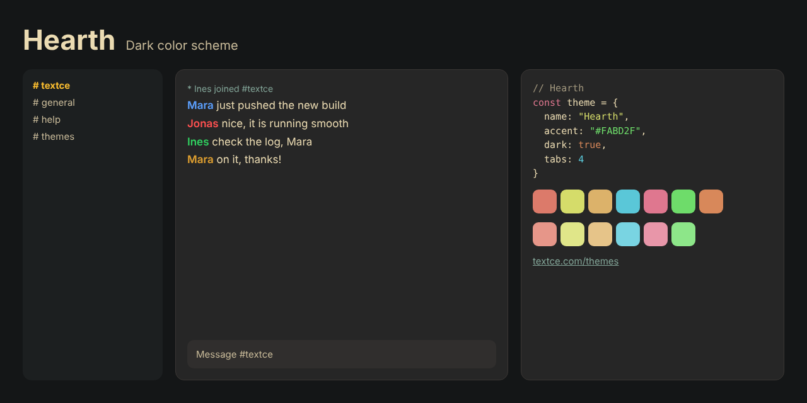

<div align="center">



<br>

# Hearth

### *The warmth of a fire, held in a color.*

[](LICENSE)  

[Overview](#overview) · [Design](#design) · [Palette](#palette) · [Install](#install) · [Accessibility](#accessibility) · [License](#license)

</div>

---

## Overview

Evening. A fire is lit. The room settles.

**Hearth** is built from that feeling: warm charcoal surfaces, cream-colored type and a restrained palette of brick, olive, amber and sage. Nothing in it is sharp. Contrast is generous but soft, like firelight on a page.

It is a theme for long sessions and deep focus, when you want your tools to feel like home.

## Design

| | |
|---|---|
| **Earth tones** | Brick red, olive green and amber are chosen from natural pigments rather than screen primaries. |
| **Soft contrast** | Text is cream rather than white, reducing the glare that builds up over many hours. |
| **Lamp-lit gold** | The accent is the warm gold of a reading lamp, easy to find and never harsh. |

## Palette

| Role | Swatch | Hex | Where |
|---|---|---|---|
| Background |  | `#262626` | Conversation area |
| Sidebar and panels |  | `#1C1F20` | Channel list, user list, window chrome |
| Inputs |  | `#302E2D` | Message box and widgets |
| Dividers |  | `#3A3634` | Lines and borders |
| Text |  | `#EBDBB2` | Messages |
| Event lines |  | `#83A598` | Joins, parts, timestamps |
| Links |  | `#83A598` | URLs and emphasis |
| Accent |  | `#FABD2F` | Selection, buttons, highlights |
| Highlight |  | `#FFCE1B` | Mentions |

Nickname colors: `#5CA0FF` `#FF5050` `#30D060` `#E0A030` `#C070F0` `#00917F`

<details>
<summary><strong>Terminal and syntax colors</strong></summary>

<br>

| | Normal | Bright |
|---|---|---|
| Black |  `#3A3634` |  `#797261` |
| Red |  `#DC7A6A` |  `#E69689` |
| Green |  `#D5DC6A` |  `#E0E689` |
| Yellow |  `#DCB26A` |  `#E6C489` |
| Blue |  `#5AC7D8` |  `#79D4E2` |
| Magenta |  `#DF778F` |  `#E896A9` |
| Cyan |  `#6EDC6A` |  `#8DE689` |
| White |  `#D4C5A0` |  `#F4EBD5` |
| Orange |  `#D8885A` | |

</details>

<details>
<summary><strong>Editor colors</strong></summary>

<br>

| Role | Hex |
|---|---|
| Selection | `#6A5629` |
| Cursor | `#FABD2F` |
| Line highlight / panels | `#1C1F20` |
| Deep panels | `#141617` |
| Comments | `#A0967D` |
| Muted text | `#C8BA99` |
| Error | `#E69689` |
| Warning | `#D8885A` |
| Success | `#D5DC6A` |

</details>

[`palette.json`](palette.json) holds every value in this theme and is the source for all the ports.

## Install

| Tool | Files |
|---|---|
| [Textce](#textce) | [`textce/`](textce) |
| [VS Code](#vs-code) | [`vscode/`](vscode) |
| [Sublime Text](#sublime-text) | [`sublime/`](sublime) |
| [Neovim and Vim](#neovim-and-vim) | [`vim/colors/`](vim/colors) |
| [Windows Terminal](#windows-terminal) | [`terminals/windows-terminal/`](terminals/windows-terminal) |
| [iTerm2](#iterm2) | [`terminals/iterm2/`](terminals/iterm2) |
| [Alacritty](#alacritty) | [`terminals/alacritty/`](terminals/alacritty) |
| [kitty](#kitty) | [`terminals/kitty/`](terminals/kitty) |
| [WezTerm](#wezterm) | [`terminals/wezterm/`](terminals/wezterm) |
| [Ghostty](#ghostty) | [`terminals/ghostty/`](terminals/ghostty) |
| [X11, urxvt, xterm](#x11) | [`terminals/xresources/`](terminals/xresources) |
| [Websites](#css-and-sass) | [`css/`](css) |

### Textce

Open **Settings › Appearance › Theme Developer**, click **Import…** and choose [`textce/hearth-theme.textcetheme`](textce/hearth-theme.textcetheme). The theme appears in your theme list immediately.

### VS Code

```sh
# macOS and Linux
cp -r vscode ~/.vscode/extensions/hearth-theme
```

```powershell
# Windows
Copy-Item -Recurse vscode "$env:USERPROFILE\.vscode\extensions\hearth-theme"
```

Restart VS Code, open **Preferences: Color Theme** and pick **Hearth**.

### Sublime Text

Copy [`hearth-theme.sublime-color-scheme`](sublime/hearth-theme.sublime-color-scheme) into your `Packages/User` folder. Open it from **Preferences › Browse Packages…**. Then choose **Preferences › Select Color Scheme…** and pick **Hearth**. Or set it directly:

```json
{ "color_scheme": "Packages/User/hearth-theme.sublime-color-scheme" }
```

### Neovim and Vim

```sh
mkdir -p ~/.config/nvim/colors && cp vim/colors/hearth-theme.vim ~/.config/nvim/colors/   # Neovim
mkdir -p ~/.vim/colors && cp vim/colors/hearth-theme.vim ~/.vim/colors/                   # Vim
```

```vim
set termguicolors
colorscheme hearth-theme
```

### Windows Terminal

Paste the entry from [`hearth-theme.json`](terminals/windows-terminal/hearth-theme.json) into the `schemes` array of `settings.json`, then:

```json
{ "profiles": { "defaults": { "colorScheme": "Hearth" } } }
```

### iTerm2

**Settings › Profiles › Colors › Color Presets… › Import…**, then choose [`hearth-theme.itermcolors`](terminals/iterm2/hearth-theme.itermcolors).

### Alacritty

```toml
# ~/.config/alacritty/alacritty.toml
[general]
import = ["~/.config/alacritty/hearth-theme.toml"]
```

### kitty

```conf
# ~/.config/kitty/kitty.conf
include hearth-theme.conf
```

### WezTerm

Copy [`hearth-theme.toml`](terminals/wezterm/hearth-theme.toml) to `~/.config/wezterm/colors/`, then:

```lua
config.color_scheme = "Hearth"
```

### Ghostty

Copy [`hearth-theme`](terminals/ghostty/hearth-theme) to `~/.config/ghostty/themes/`, then:

```
theme = hearth-theme
```

### X11

```sh
xrdb -merge terminals/xresources/hearth-theme.Xresources
```

### CSS and Sass

```html
<link rel="stylesheet" href="hearth-theme.css">
```

```css
body { background: var(--tc-bg); color: var(--tc-fg); }
a { color: var(--tc-accent-deep); }
```

A Sass variable file, [`hearth-theme.scss`](css/hearth-theme.scss), is included.

## Accessibility

| Pair | Contrast | Result |
|---|---|---|
| Text on background | 11.0 : 1 | AAA |
| Muted text on background | 7.9 : 1 | AAA |
| Links on background | 5.6 : 1 | AA |
| Accent on background | 8.9 : 1 | AAA |
| Event lines on background | 5.6 : 1 | AA |
| Comments on background | 5.2 : 1 | AA |
| Syntax and terminal colors (lowest) | 5.1 : 1 | AA |

> [!NOTE]
> Contrast is measured against the theme background with the WCAG formula. "AA large" means the pair is suitable for large text and interface elements, not body text.

## Credits

The palette of **Hearth** is derived from [Gruvbox](https://github.com/morhetz/gruvbox) by Pavel Pertsev (morhetz), which is released under the MIT license. See [`NOTICE.md`](NOTICE.md) for the upstream license notice.

Hearth is an independent Textce theme. It is not affiliated with or endorsed by the Gruvbox project.

## Contributing

Ports for other tools are welcome: JetBrains, Zed, tmux, Obsidian, bat, delta and more. Please take colors from [`palette.json`](palette.json) so every port stays identical, and keep normal text at 4.5 : 1 or better.

## The collection

| Theme | Character | Mode |
|---|---|---|
| [Textce](../textce-theme) | Flat graphite. Quiet type. The look that needs no introduction. | Dark |
| [White](../white-theme) | Bright, precise and unmistakably clean. Contrast you can feel. | Light |
| [Bookshelf](../bookshelf-theme) | Tan, cream and teal ink. The color of a quiet afternoon with a good book. | Light |
| [Bookshelf Night](../bookshelf-night-theme) | Roasted brown, cream ink and a teal that glows instead of shouts. | Dark |
| [Glacier](../glacier-theme) | Slate, frost and a single pale blue. Stillness you can work in. | Dark |
| [Dreams](../dreams-theme) | Deep indigo, soft lavender and pink with a pulse. Colour with personality. | Dark |
| [Hearth](../hearth-theme) | Warm charcoal, cream type and the amber glow of embers. | Dark |
| [Tidepool](../tidepool-theme) | Dark teal, sea glass and a clear blue. Precise, restful, deliberate. | Dark |
| [Neon Arcade](../neon-arcade-theme) | Violet night, hot pink and electric cyan. Bold on purpose. | Dark |
| [Mossglade](../mossglade-theme) | Forest depth, soft sage and lichen gold. Natural, not novelty. | Dark |
| [Fluffy Sky](../fluffy-sky-theme) | Plum, blush and bubblegum. Dark, but cheerful. | Dark |
| [BX](../bx-theme) | True black, vivid primaries and a gold cursor. The console at its most honest. | Dark |

## License

Released under the [MIT License](LICENSE). Use it, change it, ship it. The Textce name and logo are not covered by this license.

<div align="center">
<sub>Designed and made with care by Richard Ward (zeamp).<br>First introduced in <a href="https://textce.com">Textce</a>.</sub>
</div>
