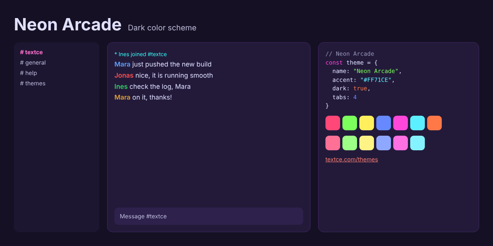

<div align="center">



<br>

# Neon Arcade

### *Long after closing. Still glowing.*

[](LICENSE)  

[Overview](#overview) · [Design](#design) · [Palette](#palette) · [Install](#install) · [Accessibility](#accessibility) · [License](#license)

</div>

---

## Overview

The arcade has closed. The machines never turned off.

**Neon Arcade** places hot pink, electric cyan and acid lime against a deep violet night. It is saturated, confident and unapologetically retro. And beneath the glow it is rigorous: every color has been tested against the background and tuned until it reads cleanly.

Put on something with a synthesizer in it. Begin.

## Design

| | |
|---|---|
| **Maximum saturation** | Colors sit at the edge of what a screen can show, which is where neon lives. |
| **Violet, not black** | A deep purple base makes the glow feel like light in a dark room. |
| **Readable, always** | Every foreground color meets accessibility contrast, so the spectacle never costs you legibility. |

## Palette

| Role | Swatch | Hex | Where |
|---|---|---|---|
| Background |  | `#231A3A` | Conversation area |
| Sidebar and panels |  | `#1D1631` | Channel list, user list, window chrome |
| Inputs |  | `#2E214C` | Message box and widgets |
| Dividers |  | `#422966` | Lines and borders |
| Text |  | `#E0E0FF` | Messages |
| Event lines |  | `#36F9F6` | Joins, parts, timestamps |
| Links |  | `#F97E72` | URLs and emphasis |
| Accent |  | `#FF71CE` | Selection, buttons, highlights |
| Highlight |  | `#FFCE1B` | Mentions |

Nickname colors: `#5CA0FF` `#FF5050` `#30D060` `#E0A030` `#C070F0` `#00917F`

<details>
<summary><strong>Terminal and syntax colors</strong></summary>

<br>

| | Normal | Bright |
|---|---|---|
| Black |  `#422966` |  `#726D8D` |
| Red |  `#FF4778` |  `#FF7096` |
| Green |  `#7CFF5C` |  `#9DFF85` |
| Yellow |  `#FFEF5C` |  `#FFF385` |
| Blue |  `#6689FF` |  `#8FA8FF` |
| Magenta |  `#FF47DA` |  `#FF70E2` |
| Cyan |  `#5CEFFF` |  `#85F3FF` |
| White |  `#CACAE6` |  `#EEEEFF` |
| Orange |  `#FF7847` | |

</details>

<details>
<summary><strong>Editor colors</strong></summary>

<br>

| Role | Hex |
|---|---|
| Selection | `#693669` |
| Cursor | `#FF71CE` |
| Line highlight / panels | `#1D1631` |
| Deep panels | `#151023` |
| Comments | `#9895B4` |
| Muted text | `#BEBCDC` |
| Error | `#FF7096` |
| Warning | `#FF7847` |
| Success | `#7CFF5C` |

</details>

[`palette.json`](palette.json) holds every value in this theme and is the source for all the ports.

## Install

| Tool | Files |
|---|---|
| [Textce](#textce) | [`textce/`](textce) |
| [VS Code](#vs-code) | [`vscode/`](vscode) |
| [Sublime Text](#sublime-text) | [`sublime/`](sublime) |
| [Neovim and Vim](#neovim-and-vim) | [`vim/colors/`](vim/colors) |
| [Windows Terminal](#windows-terminal) | [`terminals/windows-terminal/`](terminals/windows-terminal) |
| [iTerm2](#iterm2) | [`terminals/iterm2/`](terminals/iterm2) |
| [Alacritty](#alacritty) | [`terminals/alacritty/`](terminals/alacritty) |
| [kitty](#kitty) | [`terminals/kitty/`](terminals/kitty) |
| [WezTerm](#wezterm) | [`terminals/wezterm/`](terminals/wezterm) |
| [Ghostty](#ghostty) | [`terminals/ghostty/`](terminals/ghostty) |
| [X11, urxvt, xterm](#x11) | [`terminals/xresources/`](terminals/xresources) |
| [Websites](#css-and-sass) | [`css/`](css) |

### Textce

Open **Settings › Appearance › Theme Developer**, click **Import…** and choose [`textce/neon-arcade-theme.textcetheme`](textce/neon-arcade-theme.textcetheme). The theme appears in your theme list immediately.

### VS Code

```sh
# macOS and Linux
cp -r vscode ~/.vscode/extensions/neon-arcade-theme
```

```powershell
# Windows
Copy-Item -Recurse vscode "$env:USERPROFILE\.vscode\extensions\neon-arcade-theme"
```

Restart VS Code, open **Preferences: Color Theme** and pick **Neon Arcade**.

### Sublime Text

Copy [`neon-arcade-theme.sublime-color-scheme`](sublime/neon-arcade-theme.sublime-color-scheme) into your `Packages/User` folder. Open it from **Preferences › Browse Packages…**. Then choose **Preferences › Select Color Scheme…** and pick **Neon Arcade**. Or set it directly:

```json
{ "color_scheme": "Packages/User/neon-arcade-theme.sublime-color-scheme" }
```

### Neovim and Vim

```sh
mkdir -p ~/.config/nvim/colors && cp vim/colors/neon-arcade-theme.vim ~/.config/nvim/colors/   # Neovim
mkdir -p ~/.vim/colors && cp vim/colors/neon-arcade-theme.vim ~/.vim/colors/                   # Vim
```

```vim
set termguicolors
colorscheme neon-arcade-theme
```

### Windows Terminal

Paste the entry from [`neon-arcade-theme.json`](terminals/windows-terminal/neon-arcade-theme.json) into the `schemes` array of `settings.json`, then:

```json
{ "profiles": { "defaults": { "colorScheme": "Neon Arcade" } } }
```

### iTerm2

**Settings › Profiles › Colors › Color Presets… › Import…**, then choose [`neon-arcade-theme.itermcolors`](terminals/iterm2/neon-arcade-theme.itermcolors).

### Alacritty

```toml
# ~/.config/alacritty/alacritty.toml
[general]
import = ["~/.config/alacritty/neon-arcade-theme.toml"]
```

### kitty

```conf
# ~/.config/kitty/kitty.conf
include neon-arcade-theme.conf
```

### WezTerm

Copy [`neon-arcade-theme.toml`](terminals/wezterm/neon-arcade-theme.toml) to `~/.config/wezterm/colors/`, then:

```lua
config.color_scheme = "Neon Arcade"
```

### Ghostty

Copy [`neon-arcade-theme`](terminals/ghostty/neon-arcade-theme) to `~/.config/ghostty/themes/`, then:

```
theme = neon-arcade-theme
```

### X11

```sh
xrdb -merge terminals/xresources/neon-arcade-theme.Xresources
```

### CSS and Sass

```html
<link rel="stylesheet" href="neon-arcade-theme.css">
```

```css
body { background: var(--tc-bg); color: var(--tc-fg); }
a { color: var(--tc-accent-deep); }
```

A Sass variable file, [`neon-arcade-theme.scss`](css/neon-arcade-theme.scss), is included.

## Accessibility

| Pair | Contrast | Result |
|---|---|---|
| Text on background | 12.7 : 1 | AAA |
| Muted text on background | 8.9 : 1 | AAA |
| Links on background | 6.4 : 1 | AA |
| Accent on background | 6.6 : 1 | AA |
| Event lines on background | 12.5 : 1 | AAA |
| Comments on background | 5.7 : 1 | AA |
| Syntax and terminal colors (lowest) | 5.0 : 1 | AA |

> [!NOTE]
> Contrast is measured against the theme background with the WCAG formula. "AA large" means the pair is suitable for large text and interface elements, not body text.

## Contributing

Ports for other tools are welcome: JetBrains, Zed, tmux, Obsidian, bat, delta and more. Please take colors from [`palette.json`](palette.json) so every port stays identical, and keep normal text at 4.5 : 1 or better.

## The collection

| Theme | Character | Mode |
|---|---|---|
| [Textce](../textce-theme) | Flat graphite. Quiet type. The look that needs no introduction. | Dark |
| [White](../white-theme) | Bright, precise and unmistakably clean. Contrast you can feel. | Light |
| [Bookshelf](../bookshelf-theme) | Tan, cream and teal ink. The color of a quiet afternoon with a good book. | Light |
| [Bookshelf Night](../bookshelf-night-theme) | Roasted brown, cream ink and a teal that glows instead of shouts. | Dark |
| [Glacier](../glacier-theme) | Slate, frost and a single pale blue. Stillness you can work in. | Dark |
| [Dreams](../dreams-theme) | Deep indigo, soft lavender and pink with a pulse. Colour with personality. | Dark |
| [Hearth](../hearth-theme) | Warm charcoal, cream type and the amber glow of embers. | Dark |
| [Tidepool](../tidepool-theme) | Dark teal, sea glass and a clear blue. Precise, restful, deliberate. | Dark |
| [Neon Arcade](../neon-arcade-theme) | Violet night, hot pink and electric cyan. Bold on purpose. | Dark |
| [Mossglade](../mossglade-theme) | Forest depth, soft sage and lichen gold. Natural, not novelty. | Dark |
| [Fluffy Sky](../fluffy-sky-theme) | Plum, blush and bubblegum. Dark, but cheerful. | Dark |
| [BX](../bx-theme) | True black, vivid primaries and a gold cursor. The console at its most honest. | Dark |

## License

Released under the [MIT License](LICENSE). Use it, change it, ship it. The Textce name and logo are not covered by this license.

<div align="center">
<sub>Designed and made with care by Richard Ward (zeamp).<br>First introduced in <a href="https://textce.com">Textce</a>.</sub>
</div>
