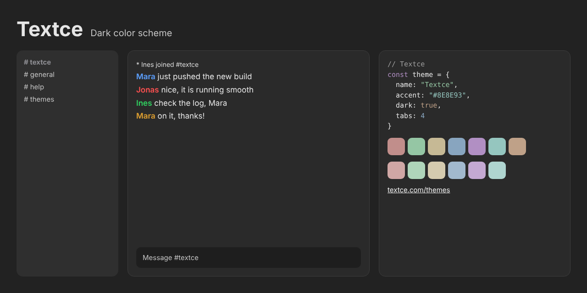

<div align="center">



<br>

# Textce

### *Nothing extra. Everything essential.*

[](LICENSE)  

[Overview](#overview) · [Design](#design) · [Palette](#palette) · [Install](#install) · [Accessibility](#accessibility) · [License](#license)

</div>

---

## Overview

Some things are finished only when there is nothing left to take away.

**Textce** is graphite, refined. A flat, even grey that recedes behind your work. Type set in soft white. A single restrained accent, used only where your eye needs to land. There is no gradient, no glow, no decoration. What remains is clarity.

It is the classic. And it is classic because it never asks for attention.

## Design

| | |
|---|---|
| **Neutral by nature** | The surface is a true graphite with no color cast, so every other color you place on it looks exactly as it should. |
| **One voice** | A single quiet accent marks selection, focus and links. Nothing else competes. |
| **Comfortable for hours** | Soft white text on mid-dark grey avoids the harshness of pure black and pure white. |

## Palette

| Role | Swatch | Hex | Where |
|---|---|---|---|
| Background |  | `#2A2A2A` | Conversation area |
| Sidebar and panels |  | `#2F2F2F` | Channel list, user list, window chrome |
| Inputs |  | `#1E1E1E` | Message box and widgets |
| Dividers |  | `#3D3D3D` | Lines and borders |
| Text |  | `#E6E6E6` | Messages |
| Event lines |  | `#DCDCDC` | Joins, parts, timestamps |
| Links |  | `#F2F2F2` | URLs and emphasis |
| Accent |  | `#8E8E93` | Selection, buttons, highlights |
| Highlight |  | `#FFCE1B` | Mentions |

Nickname colors: `#5CA0FF` `#FF5050` `#30D060` `#E0A030` `#C070F0` `#00917F`

<details>
<summary><strong>Terminal and syntax colors</strong></summary>

<br>

| | Normal | Bright |
|---|---|---|
| Black |  `#3D3D3D` |  `#797979` |
| Red |  `#C18E8B` |  `#D0A7A5` |
| Green |  `#95C6A4` |  `#AFD5BA` |
| Yellow |  `#C6B995` |  `#D5CBAF` |
| Blue |  `#88A5BF` |  `#A2B9CE` |
| Magenta |  `#B18FC3` |  `#C4A9D2` |
| Cyan |  `#95C6BF` |  `#AFD5D0` |
| White |  `#CFCFCF` |  `#F1F1F1` |
| Orange |  `#BFA188` | |

</details>

<details>
<summary><strong>Editor colors</strong></summary>

<br>

| Role | Hex |
|---|---|
| Selection | `#4A4A4C` |
| Cursor | `#8E8E93` |
| Line highlight / panels | `#2F2F2F` |
| Deep panels | `#222222` |
| Comments | `#9F9F9F` |
| Muted text | `#C4C4C4` |
| Error | `#D0A7A5` |
| Warning | `#BFA188` |
| Success | `#95C6A4` |

</details>

[`palette.json`](palette.json) holds every value in this theme and is the source for all the ports.

## Install

| Tool | Files |
|---|---|
| [Textce](#textce) | [`textce/`](textce) |
| [VS Code](#vs-code) | [`vscode/`](vscode) |
| [Sublime Text](#sublime-text) | [`sublime/`](sublime) |
| [Neovim and Vim](#neovim-and-vim) | [`vim/colors/`](vim/colors) |
| [Windows Terminal](#windows-terminal) | [`terminals/windows-terminal/`](terminals/windows-terminal) |
| [iTerm2](#iterm2) | [`terminals/iterm2/`](terminals/iterm2) |
| [Alacritty](#alacritty) | [`terminals/alacritty/`](terminals/alacritty) |
| [kitty](#kitty) | [`terminals/kitty/`](terminals/kitty) |
| [WezTerm](#wezterm) | [`terminals/wezterm/`](terminals/wezterm) |
| [Ghostty](#ghostty) | [`terminals/ghostty/`](terminals/ghostty) |
| [X11, urxvt, xterm](#x11) | [`terminals/xresources/`](terminals/xresources) |
| [Websites](#css-and-sass) | [`css/`](css) |

### Textce

Open **Settings › Appearance › Theme Developer**, click **Import…** and choose [`textce/textce-theme.textcetheme`](textce/textce-theme.textcetheme). The theme appears in your theme list immediately.

### VS Code

```sh
# macOS and Linux
cp -r vscode ~/.vscode/extensions/textce-theme
```

```powershell
# Windows
Copy-Item -Recurse vscode "$env:USERPROFILE\.vscode\extensions\textce-theme"
```

Restart VS Code, open **Preferences: Color Theme** and pick **Textce**.

### Sublime Text

Copy [`textce-theme.sublime-color-scheme`](sublime/textce-theme.sublime-color-scheme) into your `Packages/User` folder. Open it from **Preferences › Browse Packages…**. Then choose **Preferences › Select Color Scheme…** and pick **Textce**. Or set it directly:

```json
{ "color_scheme": "Packages/User/textce-theme.sublime-color-scheme" }
```

### Neovim and Vim

```sh
mkdir -p ~/.config/nvim/colors && cp vim/colors/textce-theme.vim ~/.config/nvim/colors/   # Neovim
mkdir -p ~/.vim/colors && cp vim/colors/textce-theme.vim ~/.vim/colors/                   # Vim
```

```vim
set termguicolors
colorscheme textce-theme
```

### Windows Terminal

Paste the entry from [`textce-theme.json`](terminals/windows-terminal/textce-theme.json) into the `schemes` array of `settings.json`, then:

```json
{ "profiles": { "defaults": { "colorScheme": "Textce" } } }
```

### iTerm2

**Settings › Profiles › Colors › Color Presets… › Import…**, then choose [`textce-theme.itermcolors`](terminals/iterm2/textce-theme.itermcolors).

### Alacritty

```toml
# ~/.config/alacritty/alacritty.toml
[general]
import = ["~/.config/alacritty/textce-theme.toml"]
```

### kitty

```conf
# ~/.config/kitty/kitty.conf
include textce-theme.conf
```

### WezTerm

Copy [`textce-theme.toml`](terminals/wezterm/textce-theme.toml) to `~/.config/wezterm/colors/`, then:

```lua
config.color_scheme = "Textce"
```

### Ghostty

Copy [`textce-theme`](terminals/ghostty/textce-theme) to `~/.config/ghostty/themes/`, then:

```
theme = textce-theme
```

### X11

```sh
xrdb -merge terminals/xresources/textce-theme.Xresources
```

### CSS and Sass

```html
<link rel="stylesheet" href="textce-theme.css">
```

```css
body { background: var(--tc-bg); color: var(--tc-fg); }
a { color: var(--tc-accent-deep); }
```

A Sass variable file, [`textce-theme.scss`](css/textce-theme.scss), is included.

## Accessibility

| Pair | Contrast | Result |
|---|---|---|
| Text on background | 11.5 : 1 | AAA |
| Muted text on background | 8.2 : 1 | AAA |
| Links on background | 12.8 : 1 | AAA |
| Accent on background | 4.4 : 1 | AA large |
| Event lines on background | 10.5 : 1 | AAA |
| Comments on background | 5.4 : 1 | AA |
| Syntax and terminal colors (lowest) | 5.1 : 1 | AA |

> [!NOTE]
> Contrast is measured against the theme background with the WCAG formula. "AA large" means the pair is suitable for large text and interface elements, not body text.

## Contributing

Ports for other tools are welcome: JetBrains, Zed, tmux, Obsidian, bat, delta and more. Please take colors from [`palette.json`](palette.json) so every port stays identical, and keep normal text at 4.5 : 1 or better.

## The collection

| Theme | Character | Mode |
|---|---|---|
| [Textce](../textce-theme) | Flat graphite. Quiet type. The look that needs no introduction. | Dark |
| [White](../white-theme) | Bright, precise and unmistakably clean. Contrast you can feel. | Light |
| [Bookshelf](../bookshelf-theme) | Tan, cream and teal ink. The color of a quiet afternoon with a good book. | Light |
| [Bookshelf Night](../bookshelf-night-theme) | Roasted brown, cream ink and a teal that glows instead of shouts. | Dark |
| [Glacier](../glacier-theme) | Slate, frost and a single pale blue. Stillness you can work in. | Dark |
| [Dreams](../dreams-theme) | Deep indigo, soft lavender and pink with a pulse. Colour with personality. | Dark |
| [Hearth](../hearth-theme) | Warm charcoal, cream type and the amber glow of embers. | Dark |
| [Tidepool](../tidepool-theme) | Dark teal, sea glass and a clear blue. Precise, restful, deliberate. | Dark |
| [Neon Arcade](../neon-arcade-theme) | Violet night, hot pink and electric cyan. Bold on purpose. | Dark |
| [Mossglade](../mossglade-theme) | Forest depth, soft sage and lichen gold. Natural, not novelty. | Dark |
| [Fluffy Sky](../fluffy-sky-theme) | Plum, blush and bubblegum. Dark, but cheerful. | Dark |
| [BX](../bx-theme) | True black, vivid primaries and a gold cursor. The console at its most honest. | Dark |

## License

Released under the [MIT License](LICENSE). Use it, change it, ship it. The Textce name and logo are not covered by this license.

<div align="center">
<sub>Designed and made with care by Richard Ward (zeamp).<br>First introduced in <a href="https://textce.com">Textce</a>.</sub>
</div>
